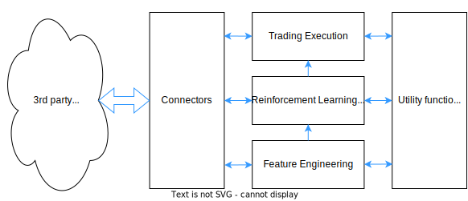

# Architecture

## Conceptual Architecture

The following diagram is a high level outline of the key components and their interactions.



### Connectors

Processes that extract and load data from internal and external applications.
For example:

- AWS services, i.e. s3
- extract data from trading platforms, i.e. MT5, IBKR etc.
- load / save data into s3 etc.
- apis to transmit data between processes / instances

### Feature engineering

Transforms raw data to model inputs.

Raw data includes:

- tick data
- candles
- announcement data (TBD)

Outputs:

- feature that are ingested into the ml and rl models

Processes:

- batch for fast prototype
- real-time for inference

### Reinforcement Agent

Reinforcement agent consists of 4 major components:

- gym environment:  Simulated trading environnment for training the agent. Further details can be found in the trading environment section
- model: Neural network used to generate predictions. Further imformation can be found in models section
- reinforcement learning algorithm: Policy and training process that defines how agents learn
- hyperparameter tuning: Application of ray.tune to experiment and optimise hyperparameters

### Trading Execution

Logic that ingests the signals generated by a deployed rl algorithm to make trades to one or more brokers. This includes:

- ingesting multiple trading signals
- ensembling logic to combine signals
- interacts with brokers

### Utility Functions

Various utility functions to enable trading including:

- infrastructure - cloud formation templates and configuration files for other applications
- deployment - functions to facilitate deploying of models and data collection processes
- apis - apis to send data between instances / processes
- configs - functions to store and interpret the configuration files and parameters

## Repository structure

The repository structureis broadly aligned with the conceptual architecture:


```
agents/             configuration files for an agent, from tick data to
│                   recommendation of trade / hold
│
apis/               api wrappers to expose functions internally and externally
│
data/               data and models generated by these functions are stored here
│
docs/
│
├── examples/       Jupyter notebooks to explain how individual components works
│
infrastructure/     templates, configurations, dockerfile, cloudformation
│                   templates, etc.
│
releat/
│
├── connectors/     Functions for communicating with external apps
│
├── data/           Functions extracting data and transforming tick to model
│   │               features
│   │
|   ├── simple/     Functions that apply one set of transforms to the tick
|   |               data of one trading instrument
|   |
│   └── complex/    Functions that combine multiple simple features
│
├── gym_env/        Defines and specifies the simulated trading environment
|                   that the RL agent will be trained on
│
├── models/         Building blocks for the neural network for the RL algorithm
│   │
|   ├── pytorch/
│   └── tf/
│
├── signals/        Deploys one agent as defined in the agents directory
│
├── trader/         Logic to combine multiple signals and execute trades
│
├── utils/          General utility functions
│   │
│   └── configs/    Key directory for processing configuration files in the
|                   agents folder + stores constants used throughout the repo
│
├── vizualization/  Visualisation tools
│
└── workflows/      Scripts for running tasks, i.e. building features, etc.

```
